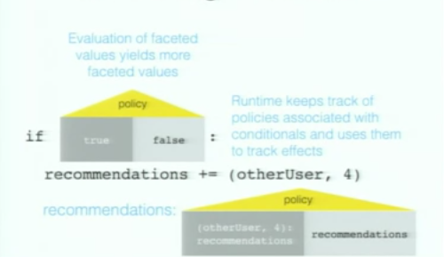
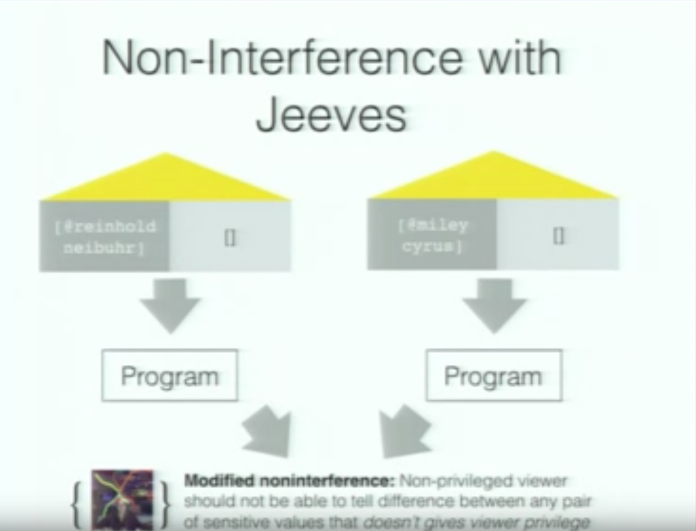
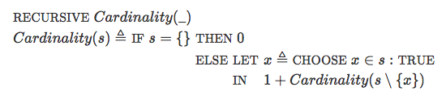
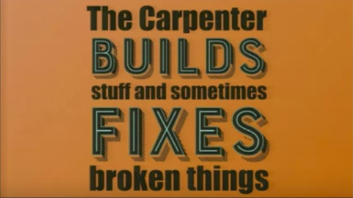
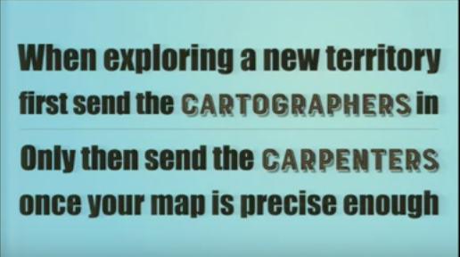

<!-- .slide: data-background="./resources/barcelona.jpg" -->

# Curry On

## Barcelona! 2017

> Academia and industry need to have a talk.

> Or rather, they just need to talk in general.

Notes:
2 Min Chill: https://www.youtube.com/watch?v=Q2Ulgu7HahI

Conference Website: http://www.curry-on.org/2017/

Recorded Talks: https://www.youtube.com/channel/UC-WICcSW1k3HsScuXxDrp0w

Aufbau: Mathe, Anwendung, Mathe, Meta, Elixir...


<!-- .slide: data-background="./resources/curry-on-sponsors-2017.png" -->
## Sponsors


## Composable Caching in Swift


> #Math-is-real ;)

> No, seriously!

Notes:
Speaker works at Pinterest.

Monoid of Caches: _Associative binary_ operator + an _identity_ element = _Monoid_

Swift Library: https://github.com/WeltN24/Carlos

Abstract: http://www.curry-on.org/2017/sessions/composable-caching-in-swift.html

Slides: https://bkase.github.io/slides/composable-caching-swift-barcelona


### Cache Protocol

```swift
protocol Cache {
  associatedtype Key
  associatedtype Value

  func get(key: Key) -> Future<Value>
  func set(key: Key, value: Value) -> Future<Void>
}
```


### Composition - Cache Layering

```swift
extension Cache {
  func compose<B: Cache>(other: B) ->
          BasicCache<Self.Key, Self.Value>
      where Self.Key == B.Key
            Self.Value == B.Value {
    return BasicCache(
      get: { k in
          self.get(k).orElse{
            other.get(k)
              .map{ v in self.set(k, v); return v }
          } }
      }
      set: { k, v in
         Future.join(self.set(k, v), other.set(k, v)) }
  }
}
```


### Associativity

```swift
let c1 = (ram.compose(disk))
    .compose(network)
// vs
let c2 = ram.compose(
    (disk.compose(network))
)
```

Notes:
Guys, this is awesome:
- Easy to understand, since order irrelevant for outcome.
- Associativity great for optimizations!


### Identity


### Monoidal Caching

```swift
let imageCache = fold(
  ramCache,
  diskCache,
  networkCache
)
```

Notes:
`fold` for free. Order does not matter.


### Optimization: Reusing inflight requests

```swift
extension Cache where K: Hashable {
  func reuseInflight(
      dict: [K: Future<V>]) -> BasicCache<K, V> {
    var dict = dict
    return BasicCache(
      get: { k in dict[k] ?? ({
              let f = self.get(k)
              dict[k] = f
              return f
           })() }
      set: self.set
    )
  }
  // logic for freeing the memory elided
}
```


### Reuse across composed caches!

```swift
let optimizedCache = diskCache.compose(netCache)
    .reuseInflight(dict)
```

Notes:
This same technique applies for any sort of cache agnostic operations you may want to perform, like concurrency throttling (e.g. only 5 concurrent requests at a time).


<!-- .slide: data-background="./resources/security.jpg" -->
## Preventing Information Leaks by Construction


> The future of security and privacy is policy-agnostic

Notes:
Fall-Beispiel erklären, An PMTool Code + Audit erinnern
Abstract: http://www.curry-on.org/2017/sessions/preventing-information-leaks-by-construction.html

[Jeeves](https://github.com/jeanqasaur/jeeves): A language with dynamic support for policy-agnostic programs. Implemented as an embedded domain-specific language in Python--a Python library that uses overloading and dynamic source-rewriting to achieve the desired semantics.


### Factor information Flow Policies Out of code

```ruby
if follow_list.include?(other_user)
  recommendations += other_user
```


### Faceted Values
- Policy, i.e. `Viewer -> Bool`
- Secret value, e.g. `follow_list`
- Default fallback, e.g. `[]`



Notes:
- Evaluation of faceted values yields more faceted values
- Runtime keeps track of policies associated with conditionals and uses them to track effects


### Non-Interference



Notes:
A non-privileged user should not be able to tell the difference between two sensitive values, e.g. `follower_list = [@christoph]` or `follower_list = [@konstantin]`.

In Jeeves policies can depend on sensitive values. E.g. "A user should only be able to see a follower_list she is a part of". So the value is sensitive, but she can definitely tell the difference between to different follower_list's she is a part of.


### Vanilla databases (SQL)

#### Why
Runtime system is nice and all, but at some point that data needs to be retrieved from a database, right?

<br>

#### Solution: ORM...

```python
class UserProfile(Model):
    email = CharField(max_length=1024)
    level = CharField(max_length=12, choices=(
      ('pm', 'pm'), ('admin', 'admin')))

    @staticmethod
    @label_for('email')
    @jeeves
    def jeeves_restrict_userprofilelabel(user, ctxt):
        return user == ctxt or (ctxt != None
          and ctxt.level == 'admin')
```

Notes:
- Years of optimizations
- Cannot load db into memory :)
- Must-have, if we want any sort of real life adoption
- People already used to ORMs
- Ex. from https://github.com/jeanqasaur/jeeves/blob/master/demo/conf/conf/models.py


## TLA+

A formal specification language developed by  [Leslie Lamport](https://en.wikipedia.org/wiki/Leslie_Lamport)



> Thinking clearly is hard; we can use all the help we can get.

Notes:
Won't present too much details. Very dense talk. Very interesting as well :)

Abstract: http://www.curry-on.org/2017/sessions/the-practice-and-theory-of-tla-.html

Blog post series: https://pron.github.io/posts/tlaplus_part1


### industry use


Notes:
At Microsoft, a critical bug was discovered in the Xbox 360 memory module during the process of writing a specification in TLA+.

Amazon Web Services has used TLA+ since 2011.

TLA+ model checking uncovered bugs in DynamoDB, S3, EBS, and an internal distributed lock manager; some bugs required state traces of 35 steps.

In addition, TLA+ specifications were found to hold value as documentation and design aids. Could be easily taught/self-taught also to people w/o math background

See https://en.wikipedia.org/wiki/TLA%2B


## Carpenters & Carthographers

```
customer.business_requirements
  => developer(coffee).software!
  => software.mostly_bugs!
```

Notes:
Simple question: What is it that we do as software developers?

Abstract: http://www.curry-on.org/2017/sessions/carpenters-cartographers.html


### Metaphors

- Set of analogies
- E.g. fingers for arithmetic:
`finger_up == +1`, `finger_up == -1`
- Can help you understand existing wisdom
- You cannot deduce *new* knowledge
- Problems: Unlawful, culturally biased, persistent (oO)


Notes:
[George Lakoff](https://en.wikipedia.org/wiki/George_Lakoff) is an American cognitive linguist, best known for his thesis that lives of individuals are significantly influenced by the central metaphors they use to explain complex phenomena.


### Carpenters

#### 0_O
> Factory Methods, Architects, Plumping, Software Carftsmen,...

- Building and creating code
- Attachment to creation
- Overly focused on tools



Notes:
Attachment to creation: Dear product owner, I have been working on this creation for days now, why do you want me to change it? I do not want to throw away my creation.

Overly focused on tools: Saying in French you can tell about the quality of a painter by looking at how she takes care of her tools. Focus on language, build tools, editors. Beispiel aus seiner Erfahrung, zuerst MongoDB. Dann requirements changed and they needed to have a history on documents. Then they had to basically do a whole rewrite to use event sourcing.


### Carthographers

#### (Mathematical) Abstractions

> Universal, permanent, lawful.

- Discovering abstractions. If requirements change, discover again. Perfectly fine.
- Domain-driven design (DDD). [Recommended Book](https://www.manning.com/books/functional-and-reactive-domain-modeling).


### But

Carpenters, Carthographers,...

These are all just metaphors!


Notes:
Troops, were unsure of how to cross the river. At some point he just took his horse and rode to where the river should have been, but there was no river there, since the summer had dried the river.


### So



```
while(true) do
  customer.business_requirements
    => developer.find_abstractions
    => developer.make_abstractions_concrete(tools)!
end
```

Notes:
Abstract first, then take out your tools to make them concrete. Rerun as often as needed. So in the end you have to be able to do both.


<!-- .slide: data-background="./resources/elixir.png" -->
## Idioms for building distributed Web Apps

Notes:
Abstract: http://www.curry-on.org/2017/sessions/idioms-for-building-distributed-fault-tolerant-applications-with-elixir.html

Elixir Language: https://elixir-lang.org/


### Why

#### Rails 2.2

```
      config.threadsafe!
```

#### 1st point of no return: FP

- Explicit State instead of implicit state
- Transformation instead of Mutation

```
      f: X -> Y
```

#### 2nd point of no return: Erlang

- Concurrency (Concurrent calls on one switch)
- Hotcode swapping (Zero-Downtime, no dropped calls)
- Industry: Heroku Router, WhatsApp (2 Million Connections on a single node)

Notes:
threadsafe = will not blow up. Will it be maintainable, easy to reason about, not have weird bugs?


### Idioms


- Processes (small, isolated, concurrent)
- Messages
- Supervisors
- Applications
- Fail fast, Fault tolerant
- Distributed (processes)


<!-- .slide: data-background="./resources/elixir2.png" -->
### Elixir

- Compatibility (with Erlang)
- Extensibility (LISP-style Macros, protocols)
- Productivity (1st class documentation; Tooling i.e. ExUnit, IEx, Mix; Hex packages)

Notes:
Macros: `assert`; Und `from` im DB-wrapper kompiliert zu geilem SQL.

Protocols: Inspect Protocol, JSON Protocol.

Doc tests: https://elixir-lang.org/getting-started/mix-otp/docs-tests-and-with.html


### Demos

### Monitoring

```
  iex -S mix phoenix.server
  > :observer.start()
```

### Macros

```elixir
  test "can add two numbers" do
    assert 1 + 2 == 3
  end
```

Notes:
Repo: https://github.com/janraasch/hello_phoenix

Monitor: Applications » hello_phoenix. Bisschen rumscrollen. Dann einen der vom Repo.Pool kontrollierten Prozesse killen. Vorher Nummer merken.

Assert:

```
code:  1 + 1 == 3
left:  2
right: 3
```

It knows the real source code `1 + 1` as well as the evaluated result `2`.


## Other Talks Recommened
- [Don't Write Tests!](http://www.curry-on.org/2017/sessions/dont-write-tests.html)
- [The Programmer’s Guide to Ideology](http://www.curry-on.org/2017/sessions/the-programmer-s-guide-to-ideology.html)
- [FP is Dead: Long Live FP](http://www.curry-on.org/2017/sessions/fp-is-dead-long-live-fp.html)
- [Rust: Putting Ownership to Use
](http://www.curry-on.org/2017/sessions/rust-putting-ownership-to-use.html)
- [Two Households, Both Alike in Dignity: A Not-So-Tragedy of Refactoring Front-end APIs](http://www.curry-on.org/2017/sessions/two-households-both-alike-in-dignity-a-not-so-tragedy-of-refactoring-front-end-apis.html)
- [Scripting with Lua](http://www.curry-on.org/2017/sessions/scripting-with-lua.html)
- [...](http://www.curry-on.org/2016/#program)

Notes: Siehe handschriftliche Notizen für Details...


## Discussion Time


Notes:
- Will there be a part II to this talk/survey?
- Developmental Breakfast Revival (e.g. online with tevim)?
- Somebody else from the team with a talk? (Could be about a book, framework, past experience,...)


## Empty slide

Notes:
for concentration/discussion... nice
